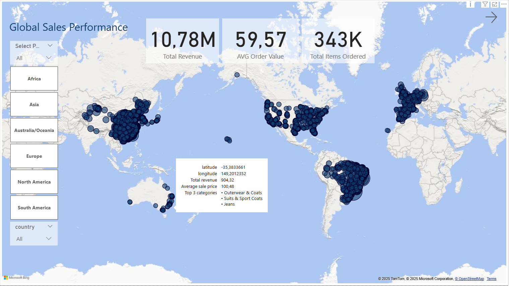
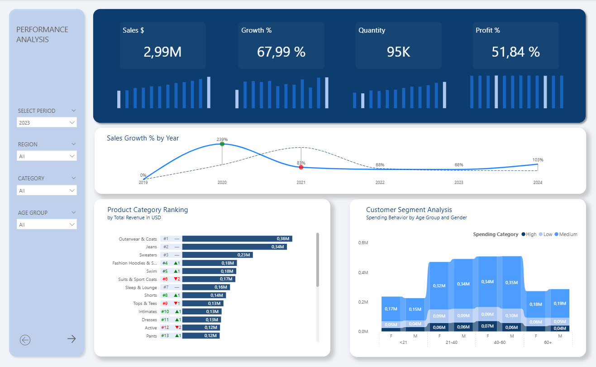
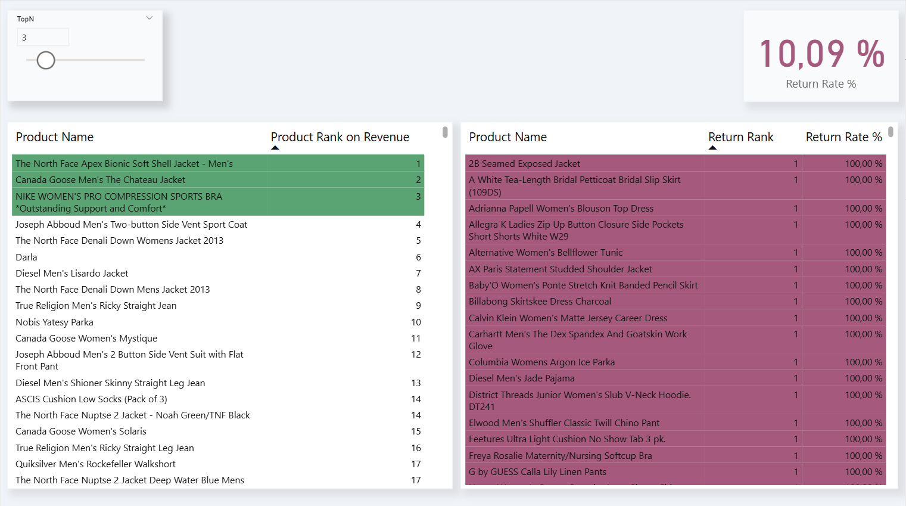

# 📊 The Look – E-Commerce Sales Dashboard (Power BI)

Dieses Projekt präsentiert ein interaktives Power BI Dashboard, das auf dem **Looker E-Commerce Dataset** basiert, bereitgestellt über Kaggle.  

Der Fokus liegt auf **Verkaufsanalyse**, **Retourenquoten**, **Produkttrends** und **Käuferverhalten**.

---

## 🔍 Projektübersicht

Die Power BI Datei (`theLook_ecommerce_dashboard.pbix`) enthält mehrere vollständig gestaltete Dashboard-Seiten zur Visualisierung von Performance-Kennzahlen und Kundensegmenten.

### 1️⃣ Global Sales Performance
- Globale KPIs: **Total Revenue**, **AVG Order Value**, **Total Items Ordered**
- Interaktive Weltkarte (nach Region, Land und Kontinent)
- Tooltip-Analyse mit **Top 3 Kategorien**, **Durchschnittspreisen** & **Umsatz nach Region**

### 2️⃣ PERFORMANCE ANALYSIS

#### 🔹 KPIs (oben)
- **Sales $** – Gesamtumsatz (aggregiert über gewählten Zeitraum)  
- **Growth %** – Jahr-über-Jahr Wachstum  
- **Quantity** – Anzahl der verkauften Produkte  
- **Profit %** – Gewinnmarge in %  
→ Alle mit integrierten **Inline-Sparkbars** zur schnellen Trendbewertung

#### 📈 Analysen im Dashboard

##### 1️⃣ Sales Growth % by Year
- Liniendiagramm mit Prozentwachstum nach Jahr
- Dynamische Farbgestaltung und Tooltips

##### 2️⃣ Product Category Ranking
- Rangfolge der Produktkategorien nach **Total Revenue (USD)**
- Dynamische Labels mit Rangänderung (▲▼)
- KPI-Balken in abgestuften Blautönen für visuelle Konsistenz

##### 3️⃣ Customer Segment Analysis
- Gestapeltes Balkendiagramm:
  - Achsen: **Age Group × Gender**
  - Legende: **Spending Category (High / Medium / Low)**
  - Darstellung des **Ausgabeverhaltens je Kundensegment**

### 3️⃣ TopN Products – Revenue & Returns
- Dynamischer TopN-Slider
- Ranking nach Umsatz & Retouren
- Rückgabequote (Return Rate %) pro Produkt
- Visuelle Trennung mit Farbkontrasten: `#59A472`, `#A4597D`

---

## 🎨 Design System

### Color Palette

| Purpose | Color | HEX |
|----------|--------|------|
| Top Category Bar | Dark Blue | `#1F4E79` |
| Standard Category Bar | Medium Blue | `#2E75B6` |
| Highlight / Hover | Light Blue | `#5B9BD5` |
| Neutral / Background | Light Gray Blue | `#E8EDF5` |
| Rank Up Indicator | Green | `#00B050` |
| Rank Down Indicator | Red | `#C00000` |
| Label / Value Text | Deep Blue | `#1A385C` |

## 💡 Zielsetzung

Das Dashboard bietet:
- Klaren Überblick über KPIs und Wachstumstrends
- Einblicke in produktbezogene und demografische Umsatztreiber
- Visuell ansprechende, datengetriebene Business Insights

Der Fokus liegt auf einer **eleganten, datenzentrierten Darstellung**, die analytisch wertvolle Einblicke liefert und gleichzeitig gestalterisch professionell wirkt.

---

## 🧩 Umsetzung & technische Details

| Kategorie | Beschreibung |
|------------|--------------|
| **Tool** | Power BI Desktop |
| **Datenquelle** | Kaggle: Looker E-Commerce BigQuery Dataset |
| **Verbindungstyp** | Ursprünglich BigQuery (jetzt statisch eingebettet) |
| **Modellierung** | Sternschema: `orders`, `order_items`, `products`, `users`, `distribution_centers` |
| **Measures** | DAX-basiert, u.a.: |
| • `Total Sales (USD)` | Umsatz in USD |
| • `Sales Growth %` | Wachstum gegenüber Vorjahr |
| • `Total Quantity` | Anzahl verkaufter Produkte |
| • `Total Cost (USD)` | Einkaufskosten |
| • `Return Rate %` | Rückgabequote (Returned Qty / Sold Qty) |
| • `Returned Products Rank` | Ranking der meist zurückgegebenen Produkte |
| • `Ranking Category` | Dynamisches RANKX basierend auf Total Sales |
| • `Ranking Development Label` | Kombination aus RANKX & Unicode-Icons (▲▼ = Platzveränderung) |
| • `TopN Color` | Dynamische Farbzuteilung basierend auf TopN-Auswahl |
| • `High/Medium/Low Spending Classification` | Segmentierung via SWITCH / AVERAGE / USERELATIONSHIP |
| **Formatierung** | Einheitliches blaues Farbschema, KPI-Sparklines, Tooltips |
| **Slicer** | Zeitraum, Region, Kategorie, Altersgruppe, dynamisches TopN |

---

## 🗂️ Projektstruktur

| Datei / Ordner | Beschreibung |
|----------------|--------------|
| `thelook_ecommerce_dashboard.pbix` | Fertiges Power BI Dashboard |
| `assets/dashboard-overview.png` | Screenshot der globalen Übersicht |
| `assets/deepdive-sales.png` | Screenshot der Performance Analyse |
| `assets/topn-products.png` | Screenshot der TopN Produktanalyse |
| `data/` | Platzhalter für CSV-Beispieldaten |

---

## 🖼️ Screenshots

### 🌍 Global Sales Performance

### 🔍 Performance Analysis (Deep Dive)

### 🧾 TopN Products by Revenue & Returns

---

## 📚 Datenquelle

**Kaggle Dataset:**  
🔗 [Looker E-Commerce BigQuery Dataset – Mustafa Keser](https://www.kaggle.com/datasets/mustafakeser/thelook-ecommerce-dataset)

- Datenquelle: Öffentliches BigQuery-Schema `thelook_ecommerce`
- Lizenz: **Nur für Bildungs- und Analysezwecke**
- ⚠️ Keine kommerzielle Nutzung erlaubt

---

## 🚀 Verwendung

1. Power BI Desktop herunterladen:  
👉 [https://powerbi.microsoft.com/desktop/](https://powerbi.microsoft.com/desktop/)

2. Dieses Repository **klonen** oder als **ZIP herunterladen**

3. Die Datei `theLook_ecommerce_dashboard.pbix` öffnen

4. Dashboard erkunden:
   - 📅 Slicer nach Jahr, Region, Kategorie oder Altersgruppe
   - 📊 Interaktive KPI-Karten & Drilldowns
   - 🎯 TopN-Filter für Produktvergleiche

📌 **Hinweis:**
- Vollständig offline lauffähig – keine BigQuery-Anmeldung notwendig
- Daten sind statisch eingebettet (Stand letzter Aktualisierung)
- Neue Daten erfordern manuelle Aktualisierung via Google BigQuery

---

## 🔒 Datenschutz & Datenverwendung

Die enthaltenen Daten sind:
- Aus einem anonymisierten, öffentlichen Dataset extrahiert
- Nicht personenbezogen
- Ausschließlich für **Demonstrations- und Bildungszwecke**

Bitte bei Weiterverwendung die Originalquelle zitieren.

---

## 🙋‍♀️ Author

**@Ramonalyst** – Data Analyst · Power BI Consultant  
📬 Connect via [LinkedIn](https://www.linkedin.com/)  
⭐ Star dieses Repository, wenn es dir gefällt oder du es nützlich findest!

---

## 📄 Lizenz

Dieses Projekt steht unter der **MIT License** – siehe [LICENSE](LICENSE)
